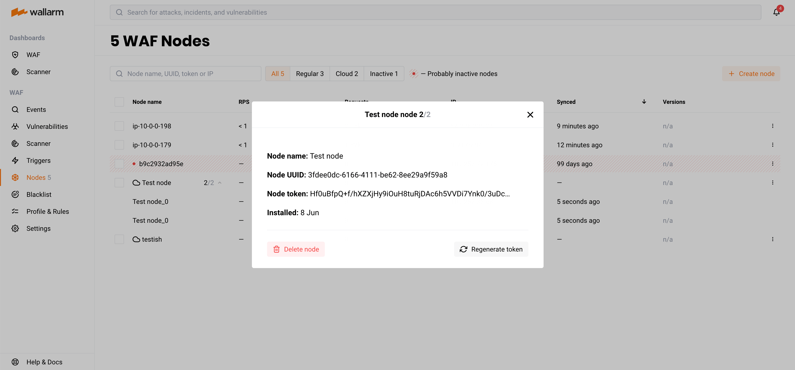

# Cloud WAF nodes

Cloud WAF node is used in cloud-based deployments on Amazon AWS, Google Cloud Platform, Heroku, and in Kubernetes Ingress controller deployments.

## Creating WAF node

You can create a cloud node while setting up integration with the platform or by following the instructions:

1. Open Wallarm UI → **Nodes**.
2. Press **Create node** and select **Cloud node**.
3. Enter node name and press **Create WAF node**.

    
4. Copy the token of created cloud node. You can also copy the token from the node card.
    
5. To complete the node installation, follow the instructions for your platfrom:
    * [Amazon AWS](../../admin-en/installation-ami-en.md)
    * [Google Cloud Platfrom](../../admin-en/installation-gcp-en.md)
    * [Heroku](../../admin-en/installation-heroku-en.md)
    * [NGINX Ingress controller](../../admin-en/installation-kubernetes-en.md)
    * [NGINX Plus Ingress controller](../../admin-en/installation-guides/ingress-plus/introduction.md)

## Viewing details of WAF node

Details of installed WAF node are displayed in the table and in the card of each WAF node. To open the card, click an appropriate table record.

The following node properties and metrics are available:

* Node name that was given to the node upon creation
* RPS: the average number of requests per second
* Node IP address
* Unique node identifier (UUID)
* Token of cloud WAF node
* Time of the last synchronization of WAF node and Wallarm cloud
* Date of WAF node creation
* Number of requests processed by the node in the current month

If one cloud WAF node is installed for multiple instances, the corresponding number of WAF nodes is grouped into one record in the table. Properties and metrics will be available for each instance.

## Regenerating the token for cloud WAF node

Token regeneration creates a new token for the node. 

1. Open Wallarm UI → **Nodes**.
2. Press **Regenerate token** in the cloud node menu or the cloud node card.
3. If the cloud node is already installed in your infrastructure, copy the new token value and specify it in installed node settings.

## Deleting WAF node

When WAF node is deleted, filtration of requests to your application will be stopped. Deleting WAF node cannot be undone. WAF node will be deleted from the list of nodes permanently.

1. Open Wallarm UI → **Nodes**.
2. Select one or more WAF nodes and press **Delete**. You can also delete WAF node by a button from a node menu or from a node card.
3. Confirm the action.

