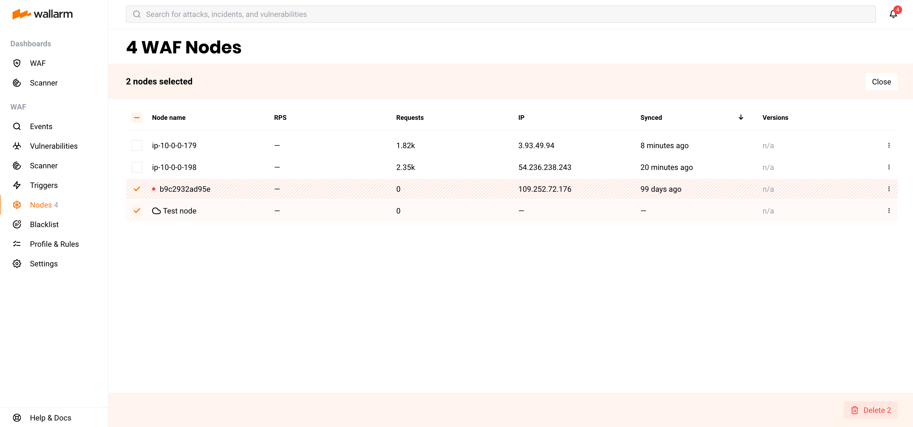

# Regular WAF nodes

Regular WAF node is used in Linux‑based, Kubernetes sidecar and Docker‑based deployments.

## Creating WAF node

Regular WAF node is created while setting up integration with the platform:

* [NGINX](../../admin-en/installation-nginx-en.md)
* [NGINX Plus](../../admin-en/installation-nginxplus-en.md)
* [Docker](../../admin-en/installation-docker-en.md)
* [Kubernetes sidecar container](../../admin-en/installation-guides/kubernetes/wallarm-sidecar-container.md)
* [Kong](../../admin-en/installation-kong-en.md)

If the integration is successfully finished, created WAF node will be displayed in the list of nodes in Wallarm UI.

## Viewing details of WAF node

Details of installed WAF node are displayed in the table and the card of each WAF node. To open the card, click an appropriate table record.

The following node properties and metrics are available:

* Node name that was given to the node upon creation
* RPS: the average number of requests per second
* Node IP address
* Unique node identifier (UUID)
* Time of the last synchronization of WAF node and Wallarm cloud
* Date of WAF node creation
* Number of requests processed by the node in the current month
* Versions of installed WAF node components

## Deleting WAF node

When WAF node is deleted, filtration of requests to your application will be stopped. Deleting WAF node cannot be undone. WAF node will be deleted from the list of nodes permanently.

1. Open Wallarm UI → **Nodes**.
2. Select one or more WAF nodes and press **Delete**. You can also delete WAF node by a button from a node menu or from a node card.
3. Confirm the action.

