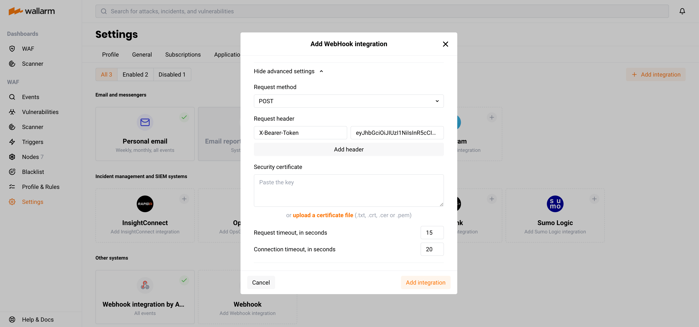
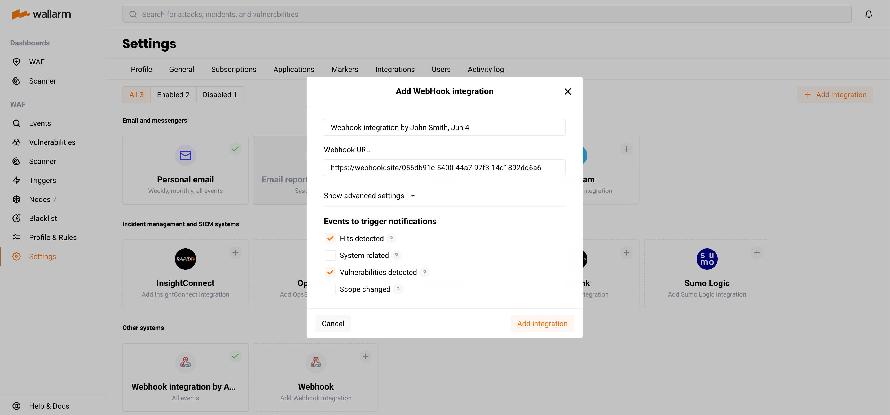

# Webhook

You can set up Wallarm to send instant notifications to any system that accepts incoming webhooks via HTTPS protocol. For this, specify Webhook URL to receive the notifications for the events:

--8<-- "../include/integrations/advanced-events-for-integrations.md"

## Notification format

Notifications are sent in JSON format. The set of JSON objects depend on the event for which the notification is sent. For example:

* Hit detected

    ```json
    [
    {
        "anomality": 0.9806949806949808,
        "domain": "example.com",
        "heur_distance": 36.28571421111111,
        "method": "GET",
        "parameter": "GET_id_value",
        "path": "/",
        "payloads": [
        "'or 1=1--"
        ],
        "point": [
        "get",
        "id"
        ],
        "probability": 36.11111118571429,
        "remote_country": null,
        "remote_port": 41616,
        "remote_addr4": "111.17.1.1",
        "remote_addr6": null,
        "datacenter": "unknown",
        "tor": "none",
        "request_time": 1591261367,
        "create_time": 1591261381,
        "response_len": 345,
        "response_status": 404,
        "response_time": 257,
        "stamps": [
        1173
        ],
        "regex": [],
        "stamps_hash": -1888294073,
        "regex_hash": -2147483648,
        "type": "sqli",
        "block_status": "monitored",
        "id": [
        "hits_production_6396_202006_v_1",
        "vpuRfnIBVc0URvOZ6ALA"
        ],
        "object_type": "hit"
    }
    ]
    ```
* Vulnerability detected

    ```json
    [
    {
        "title": "Missing \"Strict-Transport-Security\" header in server's response at '93.184.216.34:443'",
        "source": "93.184.216.34:443",
        "type": "Info",
        "domain": "www.example.com",
        "threat": "Low",
        "link": "https://my.wallarm.com/object/282157",
        "summary": "New vulnerability identified"
    }
    ]
    ```

## Setting up integration

1. Open Wallarm UI → **Settings** → **Integrations**.
2. Click the **Webhook** block or click the **Add integration** button and choose **Webhook**.
3. Enter an integration name.
4. Enter target Webhook URL.
5. If required, configure advanced settings:

    * **Request method**: `POST` or `PUT`. By default, POST requests are sent.
    * **Request header** and its value if the server requires a non-standard header to execute the request. The number of headers is not limited.
    * **Security certificate** if the server requires authorization by using the SSL certificate.
    * **Request timeout, in seconds**: if the server does not respond to the request within the specified time, the request fails. By default: 15 seconds.
    * **Connection timeout, in seconds**: if the connection to the server cannot be established during the specified time, the request fails. By default: 20 seconds.

    
6. Choose events to trigger sending notifications to Webhook URL. If the events are not chosen, notifications will not be sent.
7. Press **Add integration**.

    

## Updating integration

--8<-- "../include/integrations/update-integration.md"

## Disabling integration

--8<-- "../include/integrations/disable-integration.md"

## Deleting Integration

--8<-- "../include/integrations/remove-integration.md"
