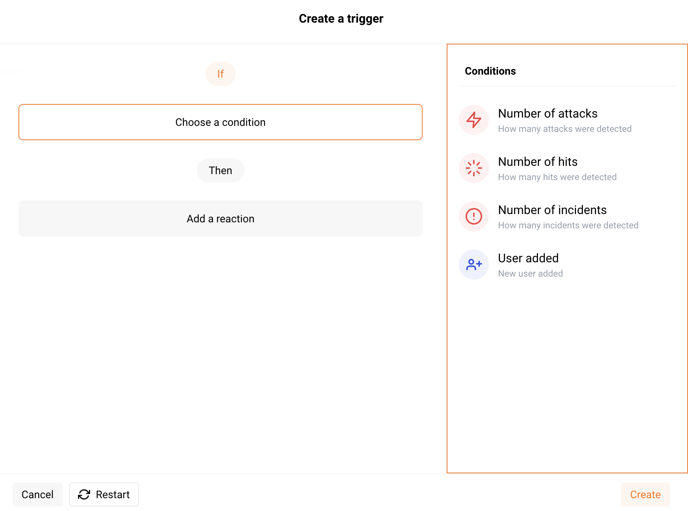
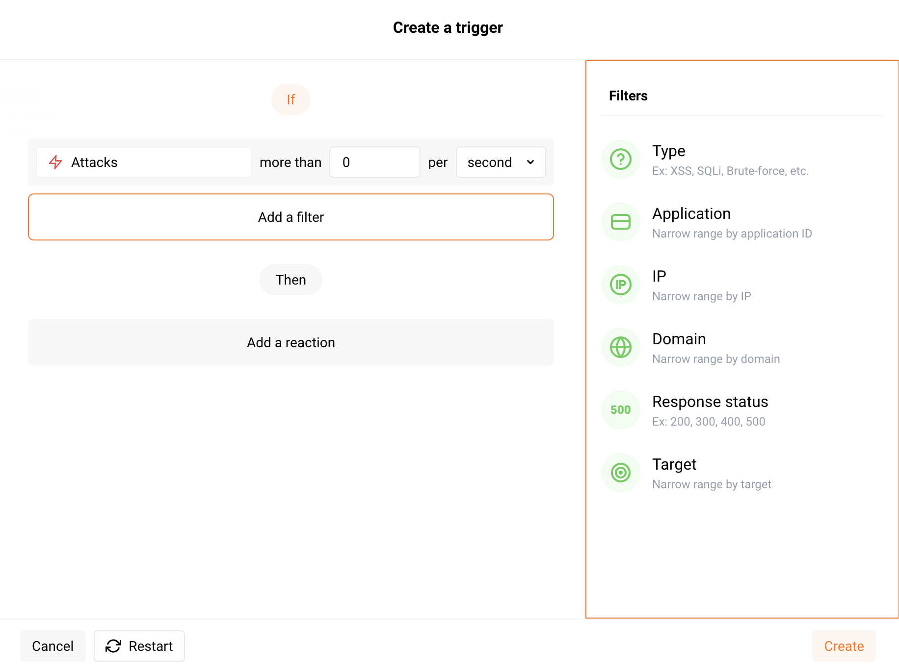
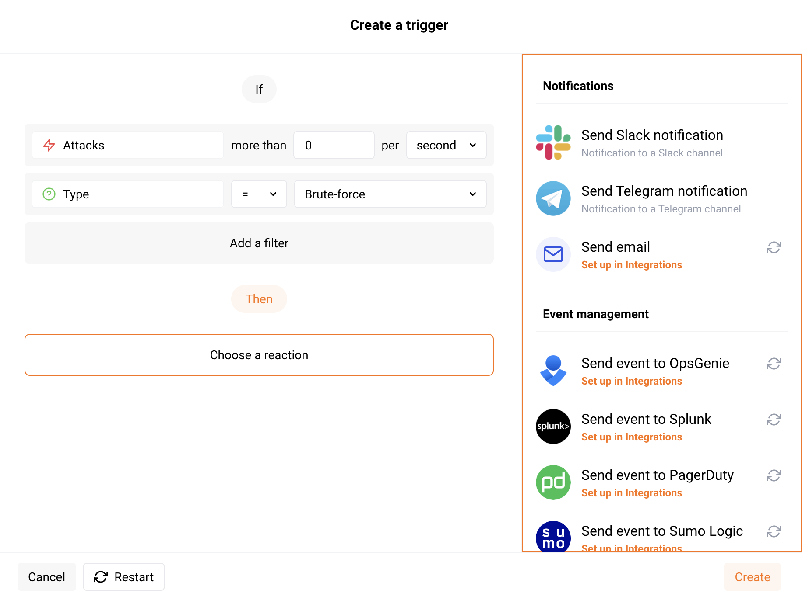

# Creating Triggers

Triggers are configured in your Wallarm account > the **Triggers** section. Only users with the **Administrator** [role](../settings/users.md) can access the section.

1. Click the **Create a new trigger** button.
2. [Choose](#step-1-choosing-a-condition) conditions.
3. [Add](#step-2-adding-filters) filters.
4. [Add](#step-3-adding-reactions) reactions.
5. [Save](#step-4-saving-the-trigger) the trigger.

## Step 1: Choosing a Condition

A condition is a system event to be notified about. The following conditions are available for notification:
* Number of attacks
* Number of hits
* Number of incidents
* User added

Choose a condition in your Wallarm account interface and set the lower threshold for the reaction, if the setting is available.

## Step 2: Adding Filters

Filters are used for condition detailing. For example, you can set up the reaction to attacks with certain types, such as brute-force attacks, SQL Injection and others.

The following filters are available for adding:

* **Type** is a [type](../../attacks-vulns-list.md) of an attack detected in the request or a type of the vulnerability the request was directed to.
* **Application** is an [application](../settings/applications.md) received a request or in which an incident was detected.
* **IP** is an IP address from which the request was sent.
* **Domain** is a domain received a request or in which an incident was detected.
* **Response status** is the response code returned to the request.
* **Target** is an application architecture part that the attack was directed at or in which the incident was detected. It can take the following values: `Server`, `Client`, `Database`.
* **User's role** is the role of the added user. It can take the following values: `Deploy`, `Analyst`, `Admin`.

Choose one or more filters in your Wallarm account interface and set values for them.

## Step 3: Adding Reactions

A reaction is an action that should be performed if the specified condition and filters are met. Reactions are divided into the **Notifications** and **Event management** groups. The tools in groups are configured as [integrations](../settings/integrations/integrations-intro.md). You can select one or more integrations from the list:
* Email
* Slack
* Telegram
* OpsGenie
* InsightConnect
* PagerDuty
* Splunk
* Sumo Logic
* Webhook

To add a reaction:
1. Set up integrations with email, messengers and incident management or SIEM systems as described in the [instruction](../settings/integrations/integrations-intro.md). To use already existing integration, skip this step.
2. Choose the configured integration in the trigger creation modal window.

    

## Step 4: Saving the Trigger

1. Click the **Create** button in the trigger creation modal window.
2. Specify trigger name and description if required and click the **Done** button.

The saved trigger will be displayed in the trigger list in your Wallarm account.

!!! info "See also"
    * [What are Triggers](triggers.md)
    * [Disabling Triggers](disable-trigger.md)
    * [Deleting Triggers](delete-trigger.md)
