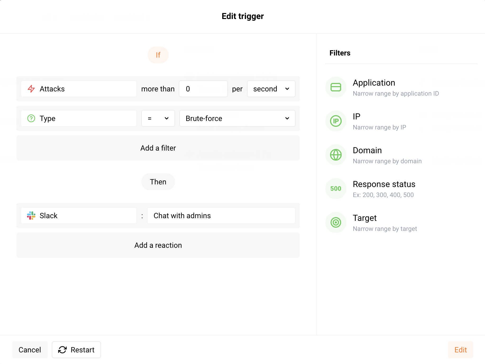
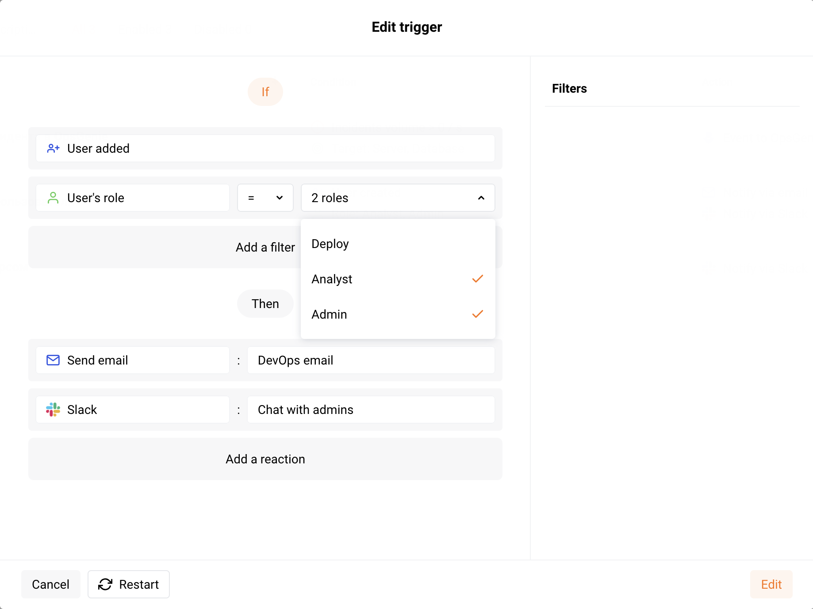

# What are Triggers

Triggers is a tool to set up custom notifications and reactions to events. Using triggers, you can receive alerts on major events via tools you use for your day-to-day workflow, for example via corporate messengers or incident management systems.

To reduce the amount of noise, you can also configure the parameters of events to be notified about. The following events are available for setup:
* [attacks](../../glossary-en.md#attack),
* [incidents](../../glossary-en.md#security-incident),
* [hits](../../glossary-en.md#hit),
* users added to the account.

To receive notifications and reports, you can use Slack, email, Sumo Logic and other [integrations](../settings/integrations/integrations-intro.md).

## Trigger examples

* Send the notification to Slack if at least one brute-force attack was detected in a second

    

* Send notifications to Slack and by email if the *Analyst* or *Admin* user was added to the account

    

* Send the data to Splunk if at least one incident with application server or database was detected in a second

    

## Demo videos

  <iframe width="1280" height="720" src="https://www.youtube.com/embed/ODHh-die9tY" frameborder="0" allow="accelerometer; autoplay; encrypted-media; gyroscope; picture-in-picture" allowfullscreen></iframe>

